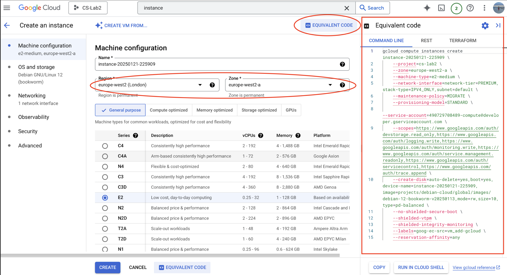

2025-01-21 22:38

Tags: [[Cloud Systems]]

# gcloud
[[Lab 2 Virtual Machines]]

1. [install](https://cloud.google.com/sdk/docs/install) gcloud cli tools
	1. install it
	2. run the install.sh script
	3. run `gcloud init`
2. The closest Google Cloud zone to London is `europe-west2-a`
3. we need to make sure we have the necessary permissions (compute.admin). See section [Creating a service account key](#creating-a-service-account-key)

### Useful commands
* `gcloud compute instances --help`: get man for gcloud compute instances or refer to [help docs](https://cloud.google.com/compute/docs/instances/) 
* `gcloud compute instances create`
* `gcloud compute instances create-with-container`

## Tips
* we can always go in the "create instance console" UI and press on "<> Equivalent Code" to get the code to create it 



## Managing instances with python
for new project:
1. create the python project
```
python3 -m venv venv
```
2. activate the venv running 
```sh
source venv/bin/activate  
```
3. pip (might be pip3 for you) install `google-cloud-compute`
```sh
pip install google-cloud-compute
```

for existing project:
```sh
pip install -r requirements.txt
```

4. run the script
```sh
python manage_vm.py
```

## Creating a service account key
> only if no one has created an access key yet, else ask the person to give the key, simply download it and place it in the project. Make sure it's added to .gitignore


### 1. Create a Service Account Key
If a service account key has not been created yet, follow these steps to create one through the Google Cloud Console:
1. Go to the [Google Cloud Console](https://console.cloud.google.com): 
2. Navigate to IAM & Admin > Service Accounts.
3. Select the project (if not selected already).
4. **Create a Service Account**:
	- Click **Create Service Account**.
	- Enter a name and description for the account.
	- Choose a role (for instance, "Owner" or "Compute Admin" to allow creation of instances).
	- Click **Done**.
5. Create a Key for the Service Account:
    - Find the service account in the list and click on it.
    - Go to the **Keys** tab.
    - Click **Add Key** > **Create New Key**.
    - Choose **JSON** as the key type and click **Create**.
    - The key file will be downloaded to the computer. This is the file to be used in the Python script.

### 2. Path to the Service Account Key
Once the JSON key file has been obtained, provide the path to it in the Python script.
For example:
- If the key file is downloaded to the **Downloads** folder, the path might look like:
    - **Windows**: `C:\Users\<Username>\Downloads\service-account-key.json`
    - **macOS/Linux**: `/Users/<Username>/Downloads/service-account-key.json`

### 3. Use the Path in the Script
In the Python script, pass the path of the service account key to authenticate the client:
python
`key_path = '/path/to/the/service-account-key.json'  # Example for macOS/Linux # OR key_path = 'C:\\Users\\Username\\Downloads\\service-account-key.json'  # Example for Windows`

Ensure the correct path is provided where the key is saved on the machine.

### 4. Optional: Set the `GOOGLE_APPLICATION_CREDENTIALS` Environment Variable
The environment variable `GOOGLE_APPLICATION_CREDENTIALS` can also be set to point to the key file. This allows Google Cloud libraries to be used without specifying the key path in the script.

`export GOOGLE_APPLICATION_CREDENTIALS=/path/to/the/service-account-key.json`
This way, the environment variable will be set before running the script, and there's no need to hard-code the path in the script.

## References
[gcloud compute instances docs](https://cloud.google.com/compute/docs/instances)

[machine family resource and comparison guide](https://cloud.google.com/compute/docs/machine-resource)

